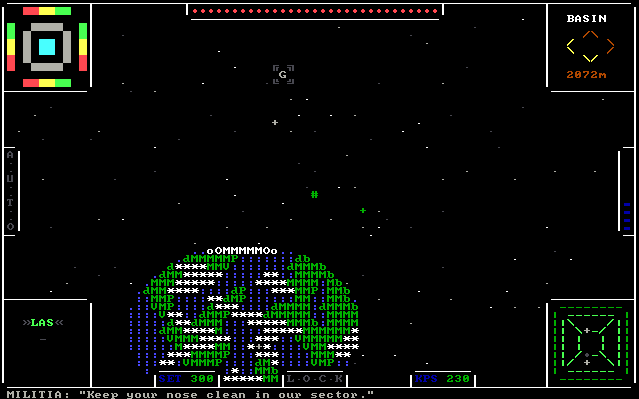
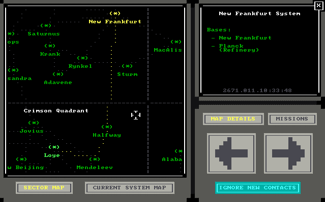
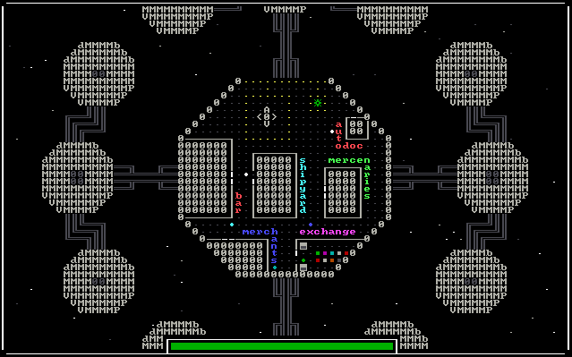
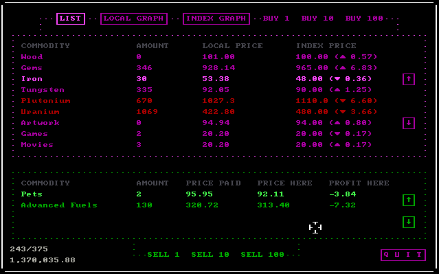
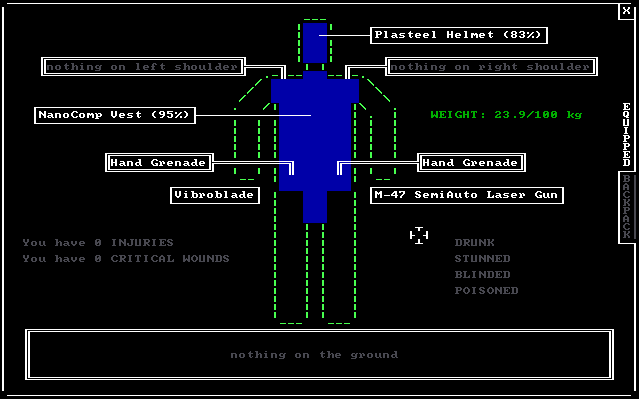
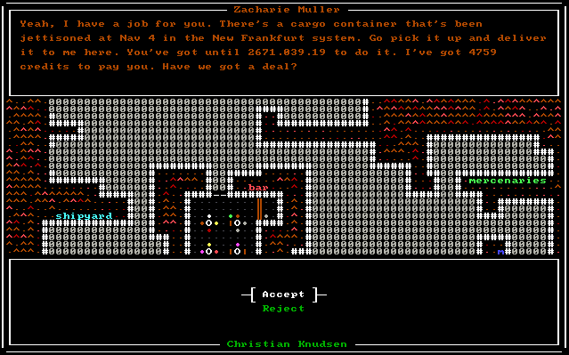
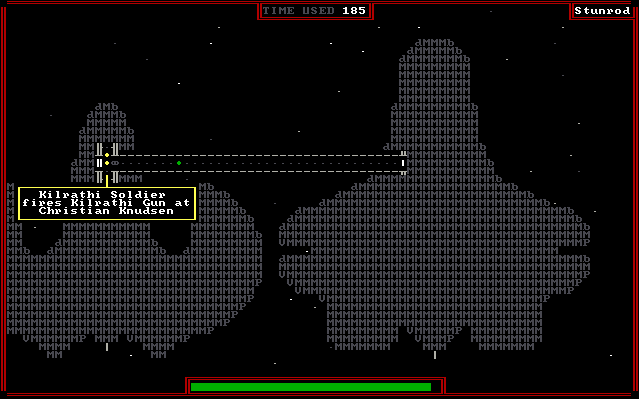

## 🪞 ASCII Sector Resources
Welcome to the ASCII Sector resources download mirror. This GitHub repository serves as a backup for game files and community quests.

The game was developed by Christian Knudsen from Laserbrain Studios.

⚠️ If you have created a quest, or if you have quests that are not already listed here, I would be happy to add them to the “Community Quests” folder.
| A Lady in Trouble | A Lady in Trouble - Part 2 | Halfway Cat-Away |
| Hitman ASCII Sector | Kilrathi Hunt | Kilrathi Intrusion |
| Saturnus in Trouble | Shootout at OK Corral | The Runners |

## 🌌 ASCII Sector: The Text-Based Space Adventure
ASCII Sector is a free game that revives the spirit of legendary combat, trading, and space exploration games such as Elite and Privateer, all wrapped up in a graphical interface made entirely from ASCII art. Yes, all the ships, planets, and characters are made from simple text characters, and it's absolutely beautiful (for those who appreciate minimalist aesthetics!).

Start with a simple spaceship, accept missions or trade goods to earn enough money and upgrade your ship or buy a new one. Engage in deadly fights both in space, on the ground and on board spaceships.

With the Ascii Sector scripting language, you can create your own quests for the game or have fun with other player's quests.

Latest version: 0.7.2
Released: January 22nd, 2016

Latest MS-DOS version : 0.3.1

## 🔗 Links
[ASCII Sector](https://www.asciisector.net/)
[ASCII Sector Wiki](https://asciisector.fandom.com/wiki/Ascii_Sector_Wiki)
[ASCII Sector Trade Chart](https://github.com/heategn/asciisector_trade_chart)
